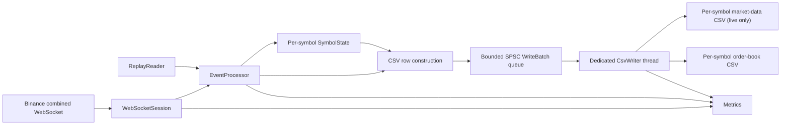
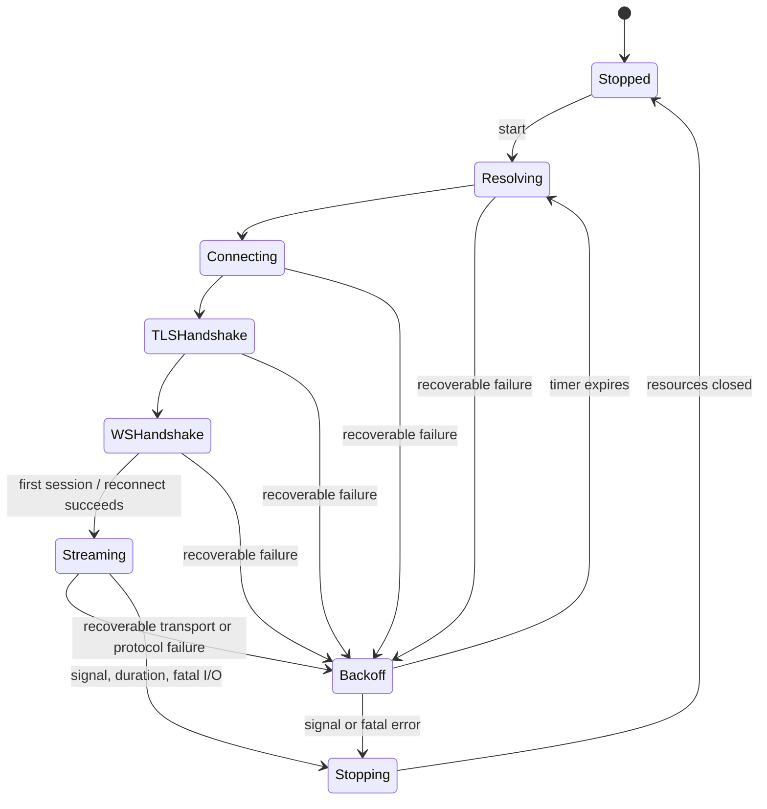

# Binance Market-Data Capture and Partial Order Book - Technical Design

Status: design baseline for implementation review.

This document defines the architecture and behavioral contract for the mandatory assignment scope. It intentionally excludes source layout, build-system implementation, and optional stretch features; those belong to later iterations.

## 1. Goals

- Capture Binance Spot or USD-M combined WebSocket streams for every configured symbol:
  - `<symbol>@depth@100ms`
  - `<symbol>@depth5@100ms`
  - `<symbol>@trade`
- Write an exact, ordered market-data audit CSV for every successfully parsed logical inbound event.
- Maintain an explicitly partial, top-five local book per symbol.
- Write the exact 26-column order-book CSV after every applied diff or partial refresh.
- Produce deterministic order-book output from the saved audit CSV without network access.
- Support multiple symbols on one WebSocket connection without data races.
- Handle reconnects, sequence gaps, control frames, bounded capture, and graceful shutdown as normal operating behavior.
- Keep parsing, book mutation, and row construction efficient enough for the performance-focused review.

## 2. Non-goals

- Full-depth order-book correctness.
- REST depth snapshot acquisition and buffered-diff synchronization.
- Multi-connection symbol sharding.
- Private/authenticated streams, order entry, or trading.
- Updating book quantities from trades.
- Runtime discovery of tick sizes or quantity precision through exchange metadata.
- Guaranteed transactional durability across two different CSV files after process or machine failure.

The absence of a REST snapshot means the program must describe its state as a partial/top-five model. A `depth5` message can refresh the visible five levels but cannot reconstruct a full Binance order book.

## 3. Fixed behavioral decisions

| Area | Decision |
|---|---|
| Language | C++17 |
| Baseline topology | One combined WebSocket connection, `shard_id=0` |
| Symbol capacity | At most 32 symbols, therefore at most 96 subscribed streams |
| URL safety limit | Reject a constructed WebSocket target longer than 8192 bytes |
| Output layout | One market-data file and one order-book file per symbol |
| Price scale | `10^8` |
| Quantity scale | `10^8` |
| Live timestamp | Wall clock captured once after a complete WebSocket message is read |
| Replay timestamp | Copy the persisted audit timestamp unchanged |
| Initial connection epoch | `0` for the first successful WebSocket session |
| `conn_seq` | Starts at `1` per `(shard_id, conn_epoch)` |
| `seqNo` | Starts at `1` independently in each symbol's order-book file |
| Instrument ID | Stable non-negative FNV-1a-derived value from the normalized uppercase symbol |
| Trade behavior | Audit only; no book mutation and no order-book row |
| Missing book level | Emit price `0` and size `0` |
| Diff row type | `D` |
| Partial refresh row type | `P` |
| Side code | `B` for bid-only diff, `S` for ask-only diff, `N` for both/neither or a symmetric refresh |

The `side` column is book-side metadata, not trade aggressor direction: `B` means the event changed only bids, `S` means it changed only asks, and `N` means both/neither or a symmetric refresh. Trades never emit order-book rows.

Instrument ID derivation is self-contained so replay needs only its audit input:

1. Compute 32-bit FNV-1a over the normalized uppercase ASCII symbol bytes using offset basis `2166136261` and prime `16777619`, with modulo-`2^32` unsigned arithmetic.
2. Clear the sign bit with `hash & 0x7fffffffU` so the value is representable as a non-negative `int32`.
3. Map a resulting zero to `1`.
4. Reject a configured symbol set if two different symbols produce the same ID.

This is an identifier, not a security hash. Its value is stable across runs, input order, platforms, live capture, and single-file replay.

### 3.1 Build, CLI, and endpoint contract

The baseline build targets Ubuntu 22.04, C++17, CMake 3.22 or newer, Boost 1.74 or newer (`Asio`, `Beast`, and `System`), and OpenSSL 3.0 or newer. GCC 11 is the compatibility floor because it is Ubuntu 22.04's default compiler; GCC 12 is the reference compiler used by the PDF's explicit build and the primary release/sanitizer evidence. simdjson 3.6.4 is deliberately vendored and pinned: its On-Demand `value::raw_json()` and low-level four-argument `minify` APIs are part of the dependency contract and are compile-tested.

The public CMake interface must support the PDF/reviewer commands verbatim:

```bash
cmake -B build
cmake --build build
cmake --build build --target tests
./build/tests/unit_tests
```

It must also support the PDF's explicit Ninja/GCC 12 form, including externally injected flags:

```bash
cmake -B build -G Ninja \
  -DCMAKE_BUILD_TYPE=Release \
  -DCMAKE_CXX_COMPILER=g++-12 \
  -DCMAKE_CXX_FLAGS="-Wall -Wextra -O2"
cmake --build build --parallel
```

Project warnings and required build options are attached per target; the project does not overwrite `CMAKE_CXX_FLAGS`, so reviewer-supplied flags compose rather than disappear. Evidence covers both the default Unix Makefiles generator with the unpinned compiler command and Ninja with explicit GCC 12. The CMake target `tests` depends on the `unit_tests` executable at exactly `build/tests/unit_tests`.

The PDF lists `zlib1g-dev`, but the project does not use or link external zlib. The Beast stream is instantiated with `deflateSupported=false`, so the client never offers `permessage-deflate` and the compression implementation is excluded. Clang 15 is not a baseline claim: the README omits the PDF template's "also tested" sentence unless that build and test run are actually performed and recorded.

The live CLI syntax is:

```bash
./build/binance_capture \
  --venue <spot|usdm> \
  --symbols BTCUSDT[,ETHUSDT...] \
  [--output-dir <directory>] \
  [--duration <positive-seconds>]
```

`--venue` and `--symbols` are required in live mode. `--output-dir` defaults to `./output`, so the assignment's shortened `--duration 300` reviewer command remains valid. Omitting `--duration` runs until a signal or fatal condition.

The exact bounded reviewer invocation is:

```bash
./build/binance_capture --venue spot --symbols BTCUSDT --duration 300
```

The deterministic offline command accepts one or more symbol-specific audit files by repeating `--replay`:

```bash
./build/binance_capture \
  --replay <first-market-data.csv> \
  [--replay <next-market-data.csv>] \
  --output-dir <distinct-directory>
```

`--replay` is mutually exclusive with `--venue`, `--symbols`, and `--duration`. Every replay input must identify a different symbol/file stem. The files may be processed independently because symbol books have no cross-symbol dependency, while all regenerated files are exclusively created in the one initially empty output directory.

Production combined-stream endpoints are exact constants:

| Venue | TLS host | Port | WebSocket target prefix |
|---|---|---:|---|
| Spot | `stream.binance.com` | `9443` | `/stream?streams=` |
| USD-M | `fstream.binance.com` | `443` | `/public/stream?streams=` |

The target appends all configured lowercase stream names separated by `/`. Production endpoints are not general user CLI or environment options. Tests may inject an alternate loopback host, expected certificate hostname, port, target prefix, and CA trust file through a test-only `WebSocketSession` configuration object; this path retains peer and hostname verification and cannot express an insecure TLS mode. This fixed-endpoint choice deliberately favors a narrow, reproducible grading interface; an exchange endpoint migration requires changing the centralized constant, rebuilding, and redeploying rather than supplying a runtime `--base-url`.

### 3.2 Design decision record

This table records load-bearing resolutions, including reversals of earlier draft assumptions. A later change to one of these decisions must update the affected contract sections, tests, and README evidence in the same revision.

| Resolution | Decision | Date | Basis |
|---|---|---|---|
| USD-M combined-stream route | Reversed the earlier assumption that `/public` contradicted the authoritative depth route; production uses `wss://fstream.binance.com/public/stream?streams=` | 2026-07-26 | Assignment requirement and current official routed depth-stream documentation |
| USD-M individual trade discrepancy | Preserve the assignment's raw `<symbol>@trade` subscription and do not substitute `<symbol>@aggTrade`; record live compatibility evidence in the README | 2026-07-26 | The current official catalog lists aggregate trades under `/market` but no longer lists the PDF-mandated individual trade under `/public`; substitution would change semantics and cannot be made silently |
| simdjson version | Reversed the proposed repin to 3.10.1; deliberately retain vendored 3.6.4 | 2026-07-26 | The pinned headers provide On-Demand `value::raw_json()` and the output-buffer `minify` overload; section 22.1 makes both APIs and byte behavior a dependency-contract test |
| Beast compression mechanism | Reversed the proposed `BOOST_BEAST_NO_ZLIB` macro because it is not a Beast 1.74 facility; instantiate `websocket::stream<NextLayer, false>` | 2026-07-26 | Pinned Beast 1.74 interface and handshake test proving that `permessage-deflate` is not offered |
| Production endpoint configuration | Removed the earlier production `--base-url` plan; use centralized fixed constants with test-only verified-TLS injection | 2026-07-26 | Narrow grading interface, bounded configuration surface, and explicit acceptance of rebuild/redeployment on endpoint migration |
| USD-M post-bridge precedence | Validate `pu == previous_diff_u` before stale classification | 2026-07-26 | Preserves strict documented predecessor chaining; duplicate redelivery after bridging deliberately invalidates and reseeds |
| Trade integration | Keep trades audit-only; they never update the diff-based book or emit an order-book row | 2026-07-26 | The subscribed trade stream does not provide depth-delta semantics |
| Binary WebSocket messages | Reject, invalidate, and reconnect; count them in the shared message-policy termination breaker | 2026-07-26 | Binance market-data streams are text; persistent binary or over-limit traffic must not create an unbounded reconnect loop |
| Generic JSON numbers | Validate number-token grammar without converting unknown/additive values into a bounded C++ numeric representation; convert only typed venue fields | 2026-07-26 | Audit eligibility depends on syntactic JSON validity, so a valid token such as `1e400` must not be rejected merely because it exceeds a parser numeric type |
| JSON nesting | Accept at most 64 simultaneously open arrays/objects, including the payload root; enforce the limit in project code rather than relying on simdjson development assertions | 2026-07-26 | The 1 MiB byte limit alone permits enough nesting to exhaust the native stack, while simdjson On-Demand depth checks are not a release-build policy boundary |

## 4. System context



Live capture and replay share `EventProcessor`, `SymbolState`, fixed-point conversion, CSV row construction, and book semantics. They differ only in how an `EventContext` and payload enter the processor.

## 5. Component responsibilities

### 5.1 Application

- Parse and validate the CLI before starting threads or opening files.
- Accept each configured symbol only if its input bytes match `[A-Za-z0-9]{1,32}`, then normalize it to uppercase for internal identity and lowercase only when constructing stream names.
- Reject empty symbols, non-ASCII or URL/control metacharacters, duplicates after normalization, unsupported venues, more than 32 symbols, more than 96 derived streams, and excessive URL length.
- Compute the complete combined target length with checked `size_t` addition from the fixed prefix, normalized symbols, exact suffixes, and separators before reserving or constructing the target. Reject overflow or a result above 8192 bytes.
- Treat configuration as all-or-nothing: never truncate the symbol list, omit a stream, split implicitly into another connection, or open files/connect after a validation failure.
- Derive stable instrument IDs from normalized symbols and reject an in-session collision before opening files or connecting.
- Own the process-wide stop state, metrics, I/O context, `boost::asio::signal_set`, writer, and mode-specific source.
- Deliver `SIGINT` and `SIGTERM` through the I/O context rather than doing application work in a native signal handler.
- Coordinate ordered shutdown and final metric reporting.

### 5.2 WebSocketSession

- Own DNS resolution, TCP socket, TLS stream, WebSocket stream, reconnect timer, and duration timer.
- Construct and connect to the venue-specific combined-stream endpoint.
- Instantiate the Beast stream as `boost::beast::websocket::stream<NextLayer, false>` so `permessage-deflate` cannot be offered or negotiated and compression code is excluded.
- Initialize the client TLS context with system trust roots and `verify_peer`. Set SNI with the selected centralized production hostname, install hostname verification for that same hostname, and check every setup call before beginning the TLS handshake.
- Expose no production CLI, environment variable, or runtime configuration that can select `verify_none`, bypass hostname verification, trust all certificates, or replace the production hostname/endpoint. Tests may inject a loopback endpoint, expected hostname, and test CA while retaining peer and hostname verification.
- Maintain the connection state machine and the active `conn_epoch`/`conn_seq`.
- Read one complete WebSocket message at a time.
- Treat Beast `async_read` as a composed complete-message operation: TCP short reads and WebSocket continuation frames remain inside Beast and are never exposed as partial logical events.
- Associate streaming completion handlers with a session-owned 128 KiB recycling allocator. Normal sequential reads reuse this arena; any upstream heap fallback is counted separately so composed-operation allocation is visible in benchmarks.
- Configure Beast's logical-message read limit to 1 MiB. An inbound logical WebSocket message rejected by the 1 MiB read limit yields no complete/auditable payload and therefore consumes neither `conn_seq` nor the complete-message counter; the `message_too_big` error follows the connection-fatal reconnect policy in section 18.
- If a read fails after receiving only part of a logical message, discard the incomplete bytes and reset the read buffer before another connection generation starts. Such a failure consumes no `conn_seq`, audit row, or complete-message count.
- Capture receive wall-clock time immediately after a complete read succeeds.
- Assign `conn_seq` before envelope or payload parsing.
- Require `got_text()` for every successfully read market-data message. A binary message is a complete pre-audit protocol rejection: it consumes `conn_seq`, increments the complete-message, binary-message, pre-audit-rejection, and message-policy-termination counters plus the breaker state, invalidates the connection's books, and reconnects without producing an audit row unless this is the fatal third breaker increment.
- Forward the complete message and connection metadata to `EventProcessor`.
- Let Beast automatically handle ping and close frames during the outstanding read, including returning the ping payload in its pong. The control callback is passive: it observes and counts ping, pong, and close frames and never sends a manual pong or close.
- Apply bounded reconnect backoff unless the application is stopping or the error is non-recoverable.

### 5.3 ReplayReader

- Read RFC 4180 CSV, including correct quoted-field handling.
- Require the exact market-data header and validate every column.
- Reconstruct `EventContext` from `recv_tsec`, `recv_tnsec`, `venue`, `stream_kind`, `shard_id`, `conn_epoch`, `conn_seq`, and `symbol`.
- Feed `payload_json` to the same `EventProcessor` used by live capture.
- Preserve input row order without generating new timestamps or sequence numbers.
- Be selected before any live-source object is constructed. Replay creates no resolver, socket, TLS context, `WebSocketSession`, reconnect timer, or other network-capable source and makes no DNS, REST, or WebSocket calls.
- Validate that rows within each symbol-specific input retain one normalized symbol and venue, that `conn_epoch` never decreases, and that `conn_seq` strictly increases while an epoch is unchanged. An epoch may increase by more than one because a symbol file need not contain an event from every successful connection.
- On an epoch increase, drive the same symbol invalidation and venue-specific chain reset used by live reconnect before applying that row; no sequence continuity is inferred across epochs.
- Refuse to overwrite an input or expected-output file accidentally.

### 5.4 EventProcessor

- Parse the combined-stream envelope once with simdjson On-Demand in live mode and extract the exact source slice for its inner `data` object.
- Resolve the envelope's `stream` view through the precomputed allocation-free route table and obtain its `SymbolState` and stream kind.
- Validate that the stream belongs to the configured subscription set.
- When the payload includes a symbol, verify it matches the envelope symbol.
- Once the envelope is valid, the stream is recognized, and `data` is a syntactically valid JSON object, construct its live audit row before depth-schema validation. A depth-schema failure is therefore recorded and can be reproduced by replay.
- Dispatch parsing by venue and stream kind; do not assume Spot and USD-M share schemas.
- Route the parsed event to exactly one `SymbolState`.
- Apply sequence validation and book mutation synchronously in processing order.
- Build an order-book row only if the event was applied and requires emission.
- In live mode, acquire one free `WriteBatch` ring slot, format its audit row and optional order-book row in place, then publish the slot. A depth-schema-invalid payload or an audit-only trade produces an audit-only batch.
- In replay mode, enqueue only an optional regenerated order-book row; never rewrite the input audit CSV.
- Count and log malformed envelopes, malformed payloads, mismatches, stale messages, and gaps without undefined behavior.

### 5.5 SymbolState

One instance exists per configured symbol and is owned exclusively by the processing thread.

It contains:

- Stable symbol-derived instrument ID and normalized symbol.
- Two bounded top-five sides.
- Book-valid flag.
- Last accepted Binance update ID.
- Venue-specific diff-chain state, including whether the USD-M diff chain has been bridged after the latest partial refresh.
- Per-file `seqNo`.
- Current connection epoch observed by this symbol.
- Per-symbol counters for refreshes, applied diffs, stale diffs, and gaps.

No other thread reads or mutates live `SymbolState`; therefore book operations require no mutex.

### 5.6 CsvWriter

- Own all file handles and output buffers on one dedicated thread.
- Create the mode-appropriate per-symbol files and exact headers before processing begins: both audit and order-book files for live capture, and only regenerated order-book files for replay.
- Consume published `WriteBatch` ring slots in producer order and release each slot only after its rows have been copied to the relevant per-file aggregation buffers or directly written.
- Write the audit row before the corresponding optional order-book row.
- Aggregate rows in fixed 256 KiB per-file userspace buffers and flush them to the kernel on threshold, a maximum one-second buffer age, orderly shutdown, or fatal error.
- Report file-open, write, flush, and close failures; a file failure is fatal because silent audit loss is unacceptable.
- Latch the first writer failure with its file, operation, native error code, and counts. Stop normal writes, account for every buffered or queued row that could not be written, release remaining queue slots, best-effort flush/close unaffected handles, and force a nonzero process result.
- Notify the I/O thread when queue occupancy falls below the resume threshold.

### 5.7 Metrics

Metrics are fixed-name `uint64_t` monotonic counters or high-water values allocated with application/symbol state before processing. Hot-path increments do not allocate. Required counters include:

- Complete WebSocket messages read.
- Pre-audit rejections, broken down by binary message, unknown stream, malformed envelope, missing/invalid `data` object, and other reason.
- Successfully parsed events by stream kind and symbol.
- Envelope and payload parse failures.
- Symbol/stream mismatches.
- Audit rows and order-book rows written.
- Stale diffs, sequence gaps, and invalidations.
- Reconnect attempts and successful connection epochs.
- Ping, pong, close, and transport errors.
- Complete binary data messages rejected before envelope parsing. This diagnostic counter is a component of the aggregate pre-audit-rejection counter, not an additional balance-equation term.
- TLS trust-store initialization, SNI setup, certificate-chain, and hostname-verification failures, classified separately.
- Incomplete logical messages discarded after read failure and stale callbacks ignored by connection generation.
- Message-policy connection terminations, broken down by binary message and oversized message, plus shared consecutive-breaker trips.
- Writer queue high-water mark and producer pauses.
- Ring-slot overflow allocations/bytes and session-handler allocator fallbacks.
- Writer calls, bytes, average/max call size, direct large rows, and age-triggered flushes.
- Stop requests, including repeated signals received after stopping began.
- Fatal file errors and audit/book rows left unwritten after a writer failure.

The program prints one stable final metrics block to `stderr` after the writer has joined for every run that completed initialization, including fatal runs. Invalid CLI/configuration that fails before initialization prints its diagnostic and exits without claiming a run summary. Hot-path logging is rate-limited; counters retain the full totals.

The metrics block is a documented versioned `key=value` format:

```text
METRICS_BEGIN version=1
run.mode=live
run.status=success
run.exit_code=0
source.complete_messages=123
events.audit_eligible=123
events.processed=123
writer.audit_rows_enqueued=123
writer.audit_rows_written=123
writer.audit_rows_unwritten=0
writer.book_rows_enqueued=87
writer.book_rows_written=87
writer.book_rows_unwritten=0
METRICS_END
```

- Keys contain lowercase ASCII letters, digits, underscores, and dots. Values are validated enum tokens or base-ten integers without grouping.
- Global keys are emitted in a fixed documented order, followed by symbols in normalized lexicographic order and their stream kinds in `depth_diff`, `depth5`, `trade` order.
- `source.complete_messages` counts successful complete live WebSocket reads. `source.replay_rows_read` is the analogous replay input-row counter; the non-applicable source key is emitted as zero.
- `events.audit_eligible` counts recognized events with a valid combined envelope and syntactically valid object payload. `events.processed` counts audit-eligible live events, or valid replay rows, that completed shared payload classification; per-kind and per-symbol forms expose the same definition.
- Schema-invalid but syntactically valid depth events are processed and counted even when they do not apply. Separate counters record schema failures, applied diffs, applied refreshes, stale events, gaps, invalidations, and trades audited.
- Enqueued counters advance only after a complete row is published. Written counters advance only after the containing `write_all` completes. On failure, unwritten counts include failed buffered rows and queued rows deliberately released during fatal shutdown accounting.
- Fatal summaries include stable failure phase/category/value fields and the first failing operation. Human-readable native error text remains in the rate-limited diagnostic log rather than in the machine-readable metric value.

For every normal completed run:

```text
source.complete_messages =
    writer.audit_rows_enqueued + events.pre_audit_rejections
```

After an orderly writer drain, `writer.audit_rows_enqueued == writer.audit_rows_written` and `writer.book_rows_enqueued == writer.book_rows_written`, with both unwritten counters equal to zero. A fatal writer failure reports all three states rather than claiming either equality.

## 6. Ownership and threading model

### 6.1 Threads

The baseline uses two threads:

1. I/O/processing thread:
   - Runs the Asio `io_context`.
   - Owns all WebSocket callbacks.
   - Parses messages and mutates every `SymbolState`.
   - Acquires free ring slots, constructs rows directly in their inline-capable buffers, and publishes them.
2. Writer thread:
   - Is the sole consumer of the bounded queue.
   - Owns all CSV file handles and blocking file writes.

Replay uses the same processing/writer boundary. Its input loop replaces the WebSocket source but does not introduce concurrent book mutation.

### 6.2 Lifetime rules

- `Application` outlives the session, processor, queue, and writer.
- `WebSocketSession` uses `std::enable_shared_from_this` and shared ownership only where required by outstanding asynchronous callbacks; all other owning relationships use single ownership.
- Each callback captures a strong session reference for its own duration; callbacks must not capture references to stack objects.
- Cross-thread writer notifications post a callback to the I/O context using a weak session reference.
- No session callback captures an owning `Application` reference. Non-owning processor, queue, metrics, and application references are valid because ordered shutdown quiesces every producer callback before their owners are destroyed.
- Every connection attempt has a monotonically increasing internal generation token distinct from the externally reported successful `conn_epoch`. Each handler captures its generation and ignores completion if it no longer matches the active attempt.
- A single idempotent terminal-completion gate arbitrates read failure, phase deadline, close completion, close deadline, and stop requests. Exactly one path may schedule reconnect or declare the session stopped.
- `boost::asio::error::operation_aborted` from deliberate cancellation is an expected completion after the gate has fired; it may increment a cancellation diagnostic but is not reported as a transport failure or allowed to reconnect.
- `SymbolState` objects are stable for the full run and are addressed by instrument ID or validated lookup, not transient references into reallocated containers.
- The queue is closed only after no producer callback can enqueue another batch.
- The writer thread is joined before metrics and application-owned state are destroyed.
- All buffers passed to asynchronous operations are session members and outlive their handlers. Parser views remain synchronous as specified in section 9.7.

### 6.3 Synchronization

- Book and sequence state need no locks because they have one owner.
- The writer queue is single-producer/single-consumer and bounded.
- Producer and consumer indices occupy separate 64-byte-aligned cache lines and use the minimum acquire/release ordering necessary for slot ownership transfer.
- A condition variable parks the writer only on the empty transition or until the next file-buffer age deadline. Before waiting, the writer acquires the sleep mutex and rechecks the queue predicate; a producer publishing into a previously empty queue performs the matching cold-transition wake protocol. No mutex or notification is taken for every tick.
- Metrics written by only one thread remain thread-local/plain counters; cross-thread totals use atomics or are merged after joining.

### 6.4 C++ type and RAII contract

- Owning raw pointers are forbidden. `std::unique_ptr` is the default dynamic owner; `std::shared_ptr` is limited to the asynchronously self-retained `WebSocketSession`.
- Socket, resolver, timer, signal, TLS, parser, buffer, file, queue, and thread resources are held by RAII-owning objects. Because C++17 has no `std::jthread`, the writer uses an explicit noexcept join guard so every construction-failure and shutdown path joins a joinable thread.
- Output handles use a move-only RAII wrapper. Normal shutdown calls an explicit checked flush/close operation so errors can be reported; its destructor is a noexcept best-effort fallback and never turns an unreported close failure into success.
- Distinct `enum class` types represent `Venue`, `StreamKind`, `SessionState`, `StopReason`, `ErrorClass`, `RowType`, and `Side`.
- Scaled price, scaled quantity, connection epoch, connection sequence, and output sequence use distinct trivial value types so incompatible integer domains cannot be mixed accidentally. Checked conversion to their CSV integer representation is explicit.
- Protocol constants, scales, headers, capacities, and hard limits are `constexpr` data. Durations use `std::chrono` types rather than unitless integers.
- Parsing, formatting, lookup, and book-observation functions accept `const` inputs and expose `const` access where mutation is unnecessary. Book changes occur only through explicit apply, refresh, invalidate, and reconnect-reset operations owned by the processing thread.
- `std::string_view` and simdjson views are non-owning synchronous values and are never stored in session, symbol, queue, or callback state.
- Project macros are limited to unavoidable compiler/platform integration. A required exception is narrowly scoped and documented at its definition; constants and inline/`constexpr` functions are not expressed as macros.

## 7. Live event flow

1. `WebSocketSession` completes one `async_read`.
2. It captures wall-clock nanoseconds and splits them into seconds and nanosecond remainder.
3. It increments and assigns `conn_seq` for the complete message.
4. If `got_text()` is false, the session counts a binary pre-audit rejection and message-policy termination, invalidates all books on the connection, and enters the reconnect path unless this is the fatal third breaker increment; no payload bytes reach `EventProcessor`.
5. `EventProcessor` parses the combined envelope with simdjson On-Demand and obtains the exact source slice of the inner `data` object.
6. It derives venue-configured symbol and stream kind from the envelope stream name.
7. It lexically minifies the exact source slice into the padded shared payload scratch buffer.
8. It traverses that minified buffer once with the shared payload On-Demand parser, confirms that it is a syntactically valid object, and fills reusable event scratch while accumulating any depth-schema error.
9. It RFC-escapes the same minified bytes into the audit row before acting on the accumulated schema result.
10. If depth schema validation fails, it enqueues an audit-only batch, counts the error, and applies the event-class failure policy: invalidate on an unreadable differential update and preserve current validity for a malformed independent partial refresh. Trade diagnostics never affect book validity.
11. Otherwise, it validates and applies the event to the symbol state when appropriate.
12. For every accepted diff or refresh, it increments `seqNo` and constructs the 26-column snapshot row using the same receive timestamp, even when an accepted diff does not alter a currently visible top-five level.
13. It publishes the completed audit row and optional snapshot row as one `WriteBatch` ring slot.
14. If the writer queue remains below the pause threshold, the session issues the next `async_read`.

Processing order is the order of completed WebSocket messages on the single connection. Each per-symbol audit file contains that symbol's subsequence of the connection order; gaps in `conn_seq` are expected when intervening messages belong to another symbol or a malformed/binary message consumed a sequence value.

## 8. Envelope routing

Expected combined envelope:

```json
{"stream":"btcusdt@depth@100ms","data":{}}
```

Routing rules:

- Precompute all expected lowercase stream names and their `{SymbolState*, StreamKind}` routes during configuration.
- Keep the route entries sorted by exact stream name and binary-search them with the envelope `std::string_view`; at the 96-stream baseline cap this takes at most seven string comparisons and no allocation.
- Require the inbound stream name to equal its documented lowercase configured name; do not create a normalized temporary string.
- While constructing the route table, map only exact known suffixes, preferring the longest exact suffix:
  - `@depth@100ms` -> `depth_diff`
  - `@depth5@100ms` -> `depth5`
  - `@trade` -> `trade`
- Obtain the already-normalized uppercase symbol and stable instrument ID from the matched route entry; do not uppercase or hash the symbol on the message path.
- Do not infer Spot `depth5` symbol or kind from its inner payload because those fields do not exist.
- If an inner payload includes `s`, require case-normalized equality with the routed symbol.
- Unknown streams are rejected and counted; they never mutate a book or produce a CSV row.

Replay already has explicit `venue`, `stream_kind`, and `symbol` columns, so it bypasses envelope parsing but enters the same payload parser and event application path.

## 9. Venue-specific payload models

### 9.1 Spot differential depth

Required fields:

- `e == "depthUpdate"`
- `E`
- `s`
- `U`
- `u`
- `b` array of `[price, quantity]`
- `a` array of `[price, quantity]`

Spot has no `pu` field.

### 9.2 Spot partial depth (`depth5`)

Required fields:

- `lastUpdateId`
- `bids` array of `[price, quantity]`
- `asks` array of `[price, quantity]`

It does not contain `e`, `E`, `T`, or `s`. The event timestamp, symbol, and kind come from receive metadata and envelope routing.

### 9.3 USD-M differential depth

Required fields:

- `e == "depthUpdate"`
- `E`
- `T`
- `s`
- `U`
- `u`
- `pu`
- `b` array of `[price, quantity]`
- `a` array of `[price, quantity]`

Documented additive fields such as `ps` or `st` are accepted and ignored unless needed for validation.

### 9.4 USD-M partial depth (`depth5`)

The current documented shape is depth-update-like and requires `e`, `E`, `T`, `s`, `U`, `u`, `pu`, `b`, and `a`. It is still applied with replacement semantics, not differential semantics.

### 9.5 Spot trade

The documented expected fields are:

- `e`: string equal to `"trade"`.
- `E`: non-negative integer event time.
- `s`: string symbol matching the envelope.
- `t`: non-negative integer trade ID.
- `p`: decimal-string price.
- `q`: decimal-string quantity.
- `T`: non-negative integer trade time.
- `m`: Boolean maker flag.
- `M`: Boolean documented ignore field.

### 9.6 USD-M trade

The assignment mandates raw `<symbol>@trade` on the USD-M `/public` route. The current official catalog no longer documents that individual stream and instead documents `<symbol>@aggTrade` under `/market`; aggregate trade is not a semantics-preserving replacement. The baseline therefore retains the grading contract below and requires the final live evidence/README to state whether the assignment endpoint still accepts it. The assignment's expected raw trade payload includes:

- `e`: string equal to `"trade"`.
- `E`: non-negative integer event time.
- `T`: non-negative integer transaction/trade time.
- `s`: string symbol matching the envelope.
- `t`: non-negative integer trade ID.
- `p`: decimal-string price.
- `q`: decimal-string quantity.
- `X`: string order type.
- `m`: Boolean maker flag.

Current additive fields such as `st` are accepted and ignored. Other additive fields are tolerated.

Trades are audit-only, so these documented payload shapes are not acceptance schemas. A routed trade requires only a syntactically valid JSON object to produce its audit row. If `e` or `s` is present, the processor checks that it identifies a trade and matches the envelope-routed symbol; a mismatch is counted and logged but the already-valid object remains auditable. It does not parse or validate `p`, `q`, IDs, timestamps, maker flags, order type, or additive fields on the hot path. Trades do not mutate `SymbolState`, increment `seqNo`, or emit order-book rows.

### 9.7 JSON parser, payload lifetime, and minification

- Use vendored simdjson 3.6.4, deliberately pinned so clean Ubuntu 22.04/GCC 11 or GCC 12 builds require no dependency download. A dependency-contract test compiles and executes `ondemand::value::raw_json()` on an object value and `simdjson::minify(const char*, size_t, char*, size_t&)` on its returned bytes; changing the pin requires this test and byte-faithfulness fixtures to pass first.
- Keep one simdjson On-Demand parser for live envelope extraction and a second On-Demand parser for the shared live/replay payload path on the processing thread.
- Reserve the Beast read buffer and preallocate both parser capacities, the padded input buffer, and one shared payload scratch buffer for the 1 MiB message limit during initialization. Copy each complete Beast message once into the reusable padded input buffer. Both padded buffers provide at least `SIMDJSON_PADDING` accessible bytes beyond their maximum logical lengths.
- Parse the combined envelope once with On-Demand. Call `raw_json()` on the `data` value before materializing it to obtain a `std::string_view` spanning the exact object bytes in the padded receive buffer.
- Pass that source view to the low-level buffer overload `simdjson::minify(const char*, size_t, char*, size_t&)`, writing directly into the shared padded payload scratch. A minification error is a malformed-payload rejection and produces no audit row. Never call the templated DOM/element `minify` or serialize a DOM value.
- Lexical minification removes only insignificant JSON whitespace. It preserves key order, duplicate keys, number lexemes such as `1e3` versus `1000`, and original string escape spelling; the resulting bytes therefore satisfy the audit contract without semantic normalization.
- Parse the minified scratch with the shared payload On-Demand parser and require its root to be an object. Iterate fields once in source order, match keys without allocating, fill a reusable typed event scratch area, and track required/duplicate fields with bit masks. Accumulate schema errors without publishing or mutating state until the complete object traversal has established syntactic validity.
- Count every open JSON array or object, including the payload root, and reject a value before descending into container depth 65. The recursive generic-field validator therefore uses at most 64 project stack frames. The payload parser is preallocated with modest extra internal depth headroom so the project guard, not a simdjson development assertion, owns the exact release behavior.
- Generic syntax traversal validates JSON number lexemes without materializing them into `double`, `int64_t`, or `uint64_t`, so representation limits do not change audit eligibility. Typed IDs, prices, and quantities still use their separately documented exact conversions and bounds.
- After successful object traversal, RFC-escape the already-minified scratch directly into the acquired ring-slot audit buffer before applying the per-kind schema result.
- Live necessarily performs one stage-one scan of the combined envelope, one lexical minification scan, and one payload parse. The payload bytes are therefore structurally scanned by the envelope and payload parsers; this is an explicit correctness/performance trade-off for byte-faithful audit output and a shared replay parser, and its cost must be measured.
- No simdjson element, string view, raw token, or receive-buffer view may escape the synchronous `EventProcessor` call.
- Replay CSV-decodes `payload_json` directly into the same padded payload scratch while retaining at least `SIMDJSON_PADDING` accessible bytes after the decoded length, then parses it once through the same payload On-Demand field visitor. It bypasses only envelope extraction, live minification, and audit-row emission.
- A DOM fallback is not present in the baseline. If On-Demand integration proves unworkable on a supported payload, the fallback and its measured cost must be documented rather than silently reparsing again.

## 10. Fixed-point decimal conversion

All price and quantity strings use a scale of `10^8`.

The parser:

- Accepts only the grammar `[0-9]+(\.[0-9]+)?`; leading `+`/`-`, a leading decimal point, a trailing decimal point, whitespace, and scientific notation are rejected.
- Requires at least one digit before the optional decimal point and at least one digit after it when it is present.
- Accumulates integer and fractional digits with checked integer arithmetic.
- Right-pads fewer than eight fractional digits with zeros.
- Rejects more than eight fractional digits unless every discarded digit is zero; no rounding is performed.
- Detects `int64_t` overflow before multiplication or addition.
- Never converts through `float`, `double`, or a locale-sensitive function.
- Formats every integer CSV field with locale-independent `std::to_chars`, without a leading plus sign or unnecessary leading zeros.

Examples:

| Input | Scaled output |
|---|---:|
| `1` | `100000000` |
| `1.25` | `125000000` |
| `0.00000001` | `1` |
| `1.250000000` | `125000000` |
| `1.250000001` | rejected |
| `+1.25` | rejected |
| `-1.25` | rejected |

Prices must be greater than zero. Partial-refresh quantities must be greater than zero. Differential quantities may be zero, where zero means remove that price level; otherwise they must be greater than zero.

## 11. Partial top-five book structure

Each side is a fixed-capacity sorted array of five `{price, quantity}` levels plus a size.

- Bids are sorted by descending price.
- Asks are sorted by ascending price.
- No heap allocation occurs during a side update.
- Updating an existing price changes its quantity in place.
- A zero quantity removes an existing level and shifts remaining levels.
- A positive new price is inserted only if it belongs in the currently modeled top five; insertion may evict the current worst level.
- A new level worse than the modeled fifth level is ignored because the model intentionally retains only the visible top five.
- If removal exposes an unknown sixth level, the model may contain fewer than five levels until the next `depth5` refresh.

Each level update is bounded by five comparisons/moves, making message work proportional to the number of updates with a small constant.

### 11.1 Update scratch and duplicate detection

- `EventProcessor` owns one 16,384-entry `LevelUpdate` scratch array allocated once during initialization. Bid and ask ranges occupy disjoint spans of that array; exceeding the combined event cap is a schema error and never truncates the event.
- Each entry stores scaled `int64_t` price and quantity plus its side. No JSON string view is retained after conversion.
- A reusable 32,768-slot open-addressed table detects duplicate `(side, price)` keys at a maximum 50% load factor. Slots carry 64-bit generation tags, so starting a message normally increments one generation counter instead of clearing the table.
- Generation wrap performs one full cold-path table clear before reuse. A table insertion failure is treated as an internal fatal error, not as permission to skip duplicate validation.
- This makes parsing and duplicate detection expected `O(updates)` with no per-message heap allocation. Applying the retained updates to five-level candidate sides is `O(updates * 5)`, which is linear with a fixed constant.

### 11.2 Partial refresh

For `depth5`:

1. Parse all supplied levels into temporary fixed-capacity sides.
2. Require at most five levels per side and validate strictly positive prices and quantities, unique prices, and strict documented best-first ordering: descending bids and ascending asks.
3. Reject and count the entire refresh if either side violates those rules; never sort or silently normalize it.
4. Validate that the best bid is lower than the best ask when both exist.
5. Obtain the refresh update ID from `lastUpdateId` (Spot) or `u` (USD-M).
6. If the current book is valid and the refresh ID is lower than the last applied book update ID, treat it as a stale refresh: audit and count it, but do not replace state or emit a snapshot.
7. Otherwise atomically replace both modeled sides and set the last book update ID to the refresh ID.
8. Reset venue-specific diff-chain alignment; for USD-M, the next diff must first bridge from this refresh before strict `pu` chaining begins.
9. Mark the partial book valid.
10. Emit one `P,N` snapshot row.

Parsing into temporary sides prevents a malformed refresh from partially corrupting the active state.

### 11.3 Differential update

After sequence acceptance:

1. Parse and validate all bid and ask updates before mutation. Reject duplicate prices within one side of an event so that no last-write-wins ordering rule is implicit.
2. Copy both active sides into temporary candidates.
3. For each candidate side, first apply every update to a price already present at the start of the event: zero removes it and a positive quantity replaces its quantity.
4. Then process positive updates for prices that were not present at the start of the event, retaining the best five prices from the union of the surviving known levels and all new candidates. A bounded keep-best-five insertion makes this result independent of update-array order.
5. Ignore zero-quantity updates for prices absent at the start of the event.
6. Validate the resulting best bid/ask relationship when both sides are present.
7. If validation succeeds, atomically commit both candidate sides and the new update ID, then emit one snapshot row.
8. Set side code to `B`, `S`, or `N` according to whether the inbound event contained bid updates, ask updates, or both/neither. An accepted diff emits a row even if all updates fall outside the currently modeled top five.

The post-event side is mathematically the best five levels of the surviving modeled state union all positive new levels. Applying known-level removal/replacement before bounded insertion prevents a worse new price from being discarded merely because a later removal would have opened capacity. Temporary copies provide commit-or-reject semantics for malformed or crossed input.

## 12. Sequence and validity state

All Binance update IDs (`U`, `u`, `pu`, and `lastUpdateId`) are parsed as non-negative JSON integer tokens into checked `uint64_t` values; floating-point, string-encoded, negative, or overflowing IDs are schema errors. Every depth event that carries both `U` and `u` must satisfy `U <= u`. A USD-M event must additionally satisfy `pu < u`; no separate `pu`-versus-`U` relation is imposed because `pu` is validated as the predecessor link after bridge initialization.

`conn_epoch`, `conn_seq`, and per-file `seqNo` are also `uint64_t`. Every increment is checked before mutation. Exhausting any of these counters causes a controlled fatal shutdown rather than wraparound or duplicate CSV identity. Any `L + 1` sequence comparison uses checked arithmetic; `L == UINT64_MAX` cannot have a representable successor and therefore cannot accept a later diff.

### 12.1 Spot

After a refresh with update ID `L`:

- If a diff has `u <= L`, it is stale and ignored.
- The next expected update ID is `L + 1`.
- If `U > L + 1`, at least one update is missing: count a gap and invalidate the book.
- Accept a diff whose range spans the expected ID: `U <= L + 1 <= u`.
- After applying it, set `L = u`.

For later diffs the same range rule applies. `U == previous_u + 1` is normal but not the sole acceptance rule; a partially overlapping event that covers the next expected ID is valid, while a fully stale range is ignored.

### 12.2 USD-M

After a valid refresh establishes book update ID `L`, the independent diff stream is not yet chained to the refresh:

- Before the bridge is established, ignore a fully stale diff with `u <= L`.
- The first applicable diff must span the next required update ID: `U <= L + 1 <= u`. Its `pu` is not required to equal the `u` of the independently delivered partial-refresh message.
- If `U > L + 1`, count a gap and invalidate the book.
- After the bridge diff is applied, store its `u` as both the last book update ID and `previous_diff_u`, and mark the diff chain established.
- After the bridge is established, validate `pu == previous_diff_u` before applying any stale/range classification. A mismatch is a gap and invalidates the book even when that event also has `u <= L`.
- Only after the post-bridge predecessor check succeeds may the event be classified as stale or applied.
- After applying a subsequent valid diff, set both the last book update ID and `previous_diff_u` to its `u`.

Every accepted USD-M `depth5` refresh resets this bridge state because the partial and differential streams are separate subscriptions even though their update IDs refer to the same market.

This strict chain-before-stale precedence deliberately sacrifices duplicate-delivery tolerance after bridging. A redelivered old diff normally carries a `pu` that no longer matches `previous_diff_u`; it is audited, counted as a gap/invalidation, emits no snapshot, and forces refresh recovery instead of being ignored. Binance promises a continuous predecessor chain, so an unexpected repeat is treated as upstream/session corruption; under this partial-book model, invalidate-and-reseed is the safer and inexpensive response.

### 12.3 Invalid state

While a symbol's book is invalid:

- Continue auditing successfully parsed depth diffs and trades.
- Do not apply depth diffs.
- Do not emit order-book rows for rejected diffs.
- The next valid `depth5` event replaces both sides, establishes its update ID, and restores validity.

### 12.4 Connection epoch

- The first successfully established WebSocket session uses epoch `0`.
- Failed connection attempts before a WebSocket session exists do not create an epoch.
- Every successful WebSocket reconnection after the first increments the epoch.
- `conn_seq` resets to `1` for the new epoch.
- Per-symbol `seqNo` does not reset on reconnect; it remains contiguous for the lifetime of that symbol's output file.
- When a session ends, every symbol on that connection is invalidated before reconnect.
- No sequence continuity is assumed across epochs.

## 13. CSV contracts and ordering

### 13.1 Market-data header

```csv
recv_tsec,recv_tnsec,venue,stream_kind,shard_id,conn_epoch,conn_seq,symbol,payload_json
```

- Emit one row for every recognized stream whose combined envelope is valid and whose inner `data` value is a syntactically valid JSON object, even if venue-schema validation fails or its depth update is later rejected as stale or gapped. This preserves the audit input required to reproduce the decision.
- A malformed envelope or non-object/invalid inner JSON cannot produce a contract-compliant payload, so it consumes `conn_seq`, increments an error counter, and produces no audit row.
- `payload_json` is the minified inner data object, never the outer combined envelope.
- `payload_json` is always emitted as a quoted CSV field. Every contained `"` byte is emitted as `""`; commas and any CR/LF bytes therefore remain inside the quoted field. The implementation uses one shared RFC 4180 field-escaping routine rather than ad hoc JSON-specific replacements.

### 13.2 Order-book header

```csv
tsec,tnsec,seqNo,id,type,side,bid0,bid1,bid2,bid3,bid4,bid_size0,bid_size1,bid_size2,bid_size3,bid_size4,ask0,ask1,ask2,ask3,ask4,ask_size0,ask_size1,ask_size2,ask_size3,ask_size4
```

- Emit exactly 26 columns.
- Emit only after an applied diff or valid partial refresh.
- Timestamp equals the triggering market-data row timestamp.
- Prices and sizes are scaled integers.
- Unavailable levels use zero price and zero size.
- Per-file `seqNo` is contiguous; rejected events do not consume it.
- The `side` values are the uppercase assignment codes `B` (bid-only), `S` (ask-only), and `N` (both/neither or refresh); they never represent trade direction.
- Every order-book data field is either a base-ten integer or a validated single ASCII character. No field can contain a comma, quote, CR, or LF, so order-book rows are quote-free by construction; this is why the PDF reviewer's `awk -F','` field-count check returns exactly 26 rather than succeeding accidentally on quoted CSV.

### 13.3 Serialization contract

- Each file starts with exactly its header shown above, followed by `\n`; no UTF-8 BOM, leading/trailing spaces, or extra header fields are emitted.
- Data records also end with `\n`. This is the documented deterministic Linux line-ending policy; RFC 4180 quoting and quote doubling are still applied to fields.
- Numeric fields use `std::to_chars` and textual enum/symbol fields are validated before formatting.
- Construct each complete record directly in the acquired reusable ring-slot buffer before publishing it. Capacity may grow only within the documented hard limits; a row is never cropped to fit a buffer.
- The writer uses a `write_all` loop, or an equivalent buffered-file operation whose result is checked, until every byte of the record is accepted. A short write that cannot be completed is a fatal file error and is never reported as a successful row.
- Live message-limit rejection, replay record-limit rejection, buffer exhaustion, and file failure are explicit counted errors; none is converted into a truncated CSV field or record.

### 13.4 File naming

For a symbol-specific audit file:

```text
market_data_<venue>_<SYMBOL>_<UTC-date>.csv
```

The corresponding book file is:

```text
<market-data-file-stem>_orderbook.csv
```

If a run crosses UTC midnight, the baseline keeps the run's start date in the filename rather than rotating files mid-session. The README will state this policy.

### 13.5 Output initialization

- Before starting any thread or network operation, compute every target path.
- The output directory may be created by the program or may already exist only if it is empty.
- Open every output file with exclusive-create semantics. Never append to or truncate an existing file.
- If any target or unrelated directory entry already exists, fail with a clear path-specific error before capture/replay begins.
- Replay requires an output directory distinct from every input file's directory and derives `<input-stem>_orderbook.csv` there for each repeated `--replay` input.

Thus "output starts empty" means newly and exclusively created output, not destructive truncation. A second run on the same UTC date uses a new empty output directory.

## 14. Writer queue and backpressure

The queue is a 4096-slot SPSC ring constructed before capture/replay begins. A `WriteBatch` is a reusable ring slot, not a temporary object whose strings are allocated, moved, and destroyed on every event.

Each slot contains:

- Target instrument/file ID.
- An SBO-style audit-row buffer with 4 KiB inline storage and an order-book-row buffer with 2 KiB inline storage.
- Presence flags for the optional audit row (live only) and optional order-book row.
- Connection and application sequence metadata for diagnostics.

The producer acquires the next free slot, clears its logical sizes, and formats directly into the inline buffers. Publishing the producer index transfers exclusive slot ownership to the writer. The writer writes both rows, resets the slot, and publishes the consumer index; no row buffer is copied or moved between heap-owning objects.

An exceptional row larger than its inline capacity may allocate overflow storage up to the 3 MiB record limit. The writer releases that overflow before returning the slot to the producer, preventing one large event from multiplying retained capacity across 4096 slots. Large-row allocation count and bytes are explicit metrics; normal rows within inline capacity require no row-buffer allocation.

The queue is bounded by both 4096 occupied slots and 64 MiB of logical queued row bytes. Reaching 75% of either limit pauses production, and draining below 50% resumes it. Slot count, logical bytes, and active overflow-storage bytes are reported separately so SBO use cannot hide exceptional memory growth.

Logical-byte occupancy uses separate cache-line-aligned monotonic totals: only the producer writes `bytes_published`, only the consumer writes `bytes_released`, and each side reads the other total with acquire semantics. Outstanding bytes are their checked difference; no contended read-modify-write atomic is executed for each event. Counter additions are checked, with overflow treated as controlled fatal shutdown.

For each output file, `CsvWriter` owns a 256 KiB aggregation buffer allocated during initialization:

- Append ordinary rows until the next row would exceed the threshold, then complete-write the current buffer and reuse it.
- Flush an individual row larger than 256 KiB directly after first draining that file's aggregation buffer.
- A timed writer wait flushes any non-empty aggregation buffer whose oldest byte has waited one second.
- Retain the audit/book row counts represented by each non-empty aggregation buffer. Increment written-row counters only after the corresponding `write_all` succeeds, so a failed flush can report buffered rows accurately as unwritten.
- These flushes transfer bytes to the kernel page cache; the baseline does not call `fsync` per batch. Orderly shutdown performs the final checked flush/close.
- Metrics count file-write calls, bytes per call, direct large-row writes, age flushes, and flush failures.

Backpressure policy:

1. Before issuing another `async_read`, the producer checks both occupancy dimensions. The 75% high-water mark leaves at least 16 MiB and 1024 slots free, more than the maximum one-message `WriteBatch`, so the already-started read can always be published without exceeding a hard bound.
2. The writer continues draining without contending on book state.
3. When occupancy falls below a low-water mark, the writer posts a resume notification to the I/O context.
4. No market event or CSV row is silently dropped.
5. A five-second pause-duration watchdog treats sustained storage backpressure as fatal before protocol liveness becomes ambiguous.

Stopping reads briefly also delays processing control frames because WebSocket control frames are handled during reads. Queue sizing and watermarks must therefore make pauses exceptional and short. If the writer cannot recover promptly, an explicit fatal shutdown is safer than silently losing audit data or pretending the connection remains healthy.

## 15. WebSocket lifecycle



Rules:

- Only one async operation of each required category is outstanding at a time.
- DNS resolution, TCP connect, TLS handshake, WebSocket handshake, and graceful WebSocket close have steady-clock deadlines of 5, 5, 10, 10, and 2 seconds respectively. Each deadline belongs to the same connection generation as the operation it guards.
- Recoverable failures use equal-jitter exponential backoff. Attempt `n` has a capped delay `C = min(30 s, 250 ms * 2^n)` and selects a delay uniformly from `[C/2, C]`; the cap calculation is saturating.
- The live jitter source is created once at startup. Tests inject a fixed source, so exact retry-delay boundaries are reproducible without making replay depend on randomness.
- The backoff attempt resets only after a connection has remained in `Streaming` for 30 continuous seconds. A handshake success followed by an immediate disconnect therefore cannot create an aggressive reconnect loop.
- A successful WebSocket reconnection advances `conn_epoch`; repeated failed attempts do not.
- TLS verification failures, invalid configuration, and output-file failures are fatal rather than endlessly retried. Treating certificate-chain or hostname failure as fatal deliberately prioritizes verified identity over availability; retrying the same endpoint with full verification would not itself be insecure, but this baseline chooses a visible failed run over waiting through a potentially persistent trust failure.
- Beast automatically responds to Spot's documented approximately 20-second ping cadence and USD-M ping frames with a pong carrying the received payload while an `async_read` is outstanding. The passive control callback only observes/counts ping, pong, and close frames; application code never sends a second pong from it.
- USD-M liveness accounting follows its documented ping/pong interval and deadline.
- The client never offers `permessage-deflate`; successfully accepted market-data messages are uncompressed WebSocket text messages.
- The expected 24-hour server disconnect follows the same reconnect path as other recoverable disconnects.
- Backoff and reconnect timers are cancellable during shutdown.
- Every asynchronous completion first checks its connection generation and then the terminal gate before changing state, publishing a batch, reconnecting, or completing shutdown.
- A phase timeout cancels or closes the operation at the lowest safe layer. The resulting late completion is consumed as expected cancellation and cannot schedule a second transition.
- Each recoverable or fatal failure increments its full-resolution counter. Rate-limited logs include phase, session state, venue, generation, `conn_epoch` when established, native error category/value, retry attempt/delay when applicable, and the chosen action; payload bytes are not logged.

### 15.1 Complete-message and reconnect semantics

- Beast assembles all TCP short reads and fragmented WebSocket frames into the session-owned dynamic buffer. The application invokes `EventProcessor` only after `async_read` reports a successful complete logical message.
- The reusable read buffer has the same 1 MiB hard capacity as the logical-message policy. Beast 1.74 may surface a one-over-limit frame as `websocket::error::buffer_overflow` before `message_too_big`; both native errors map to the single stable oversized-message policy classification.
- A failed composed read may leave incomplete bytes in the dynamic buffer. Those bytes are never parsed, logged as payload, assigned a sequence, or carried into another connection; teardown consumes the entire buffer before the next generation starts.
- A complete message is copied into parser input only after the successful read completion. The Beast read buffer is consumed after synchronous processing has finished, so no parser or callback retains a view into consumed storage.
- A binary-message rejection or `message_too_big` read termination increments one process-level consecutive message-policy breaker that persists across reconnects. Only publishing a later audit row resets it. Unknown/malformed text, invalid/non-object `data`, incomplete reads, and ordinary transport failures neither increment nor reset it. The third binary/oversize termination in any combination before a reset is process-fatal. This audited-message reset prevents envelope garbage from masking repeated policy-forced connection recycling while keeping transient transport failures outside the breaker.
- A transport/protocol failure invalidates every affected symbol exactly once through the terminal gate. Recoverable classification schedules exactly one backoff timer; fatal classification enters application shutdown.
- Expected cancellation after an application stop, phase timeout, or superseding connection generation is counted separately from unexpected transport failure.

### 15.2 Capture-duration semantics

- `--duration N` means `N` seconds of total steady-clock elapsed run time, not accumulated connected time.
- The duration clock starts immediately before the first DNS-resolution attempt, after configuration validation and successful output-file initialization.
- DNS, TCP/TLS/WebSocket handshakes, reconnect backoff, and disconnected intervals consume the duration budget.
- When the deadline expires, no new read is initiated and normal ordered shutdown begins.
- Queue draining and final file flush may make process exit occur slightly after the requested duration; this tail is reported separately and is not counted as capture time.
- Replay rejects `--duration` because end-of-input defines its run boundary.

## 16. Shutdown behavior

Shutdown triggers:

- `SIGINT` or `SIGTERM`.
- Expiration of `--duration`.
- Fatal configuration, TLS, parsing-policy, queue-watchdog, or file error.
- Normal replay end-of-file.

Ordered shutdown:

1. Atomically transition the application to stopping; subsequent stop requests are idempotent.
2. The first `SIGINT` or `SIGTERM` requests this graceful path. The signal wait remains armed while the I/O context runs; later signals increment the repeated-stop counter and call the same idempotent stop entry point. They do not call `abort`, `_Exit`, or bypass writer accounting.
3. Cancel duration, reconnect, resolve, and connection timers.
4. Stop initiating new reads or replay records.
5. If a WebSocket session is active and the transport permits it, initiate an asynchronous close handshake with the two-second deadline; otherwise cancel/close the lowest layer.
6. Through the session terminal gate, wait until every producer callback has either completed or returned as stale/cancelled and no callback can enqueue another batch.
7. Close the writer queue.
8. Drain queued batches, flush and close every file.
9. If a write, flush, or close fails during step 8, latch fatal status and preserve the first error context. Stop normal writes, count every buffered or queued audit/book row that remains unwritten, release all queue slots so shutdown cannot deadlock, and best-effort flush/close unaffected handles. A failed drain is never reported as orderly.
10. Join the writer thread.
11. Cancel the signal wait, print final metrics including enqueued/written/unwritten counts, and return zero only if capture/replay and the complete writer drain succeeded. Any latched writer error forces a nonzero result.

A successful orderly shutdown guarantees that every accepted row was passed completely to the kernel and every descriptor was checked and closed. It does not guarantee persistence across an operating-system crash or power loss because the baseline deliberately does not call `fsync` or `fdatasync`.

No callback may access destroyed application, session, symbol, queue, or file state.

## 17. Replay determinism

For each audit row, replay uses exactly:

- Persisted timestamp.
- Persisted venue and stream kind.
- Persisted connection epoch and sequence.
- Persisted symbol.
- Persisted inner payload.

It then executes the same venue-specific payload parsing, sequence validation, partial-book mutation, row-type/side selection, scaling, and CSV formatting as live capture.

Determinism conditions:

- No current time, randomness, network state, hash iteration order, locale, or floating-point conversion affects output.
- Instrument ID is recomputed from each audit row's normalized symbol using the fixed FNV-1a procedure; replay needs no hidden symbol-order configuration or external mapping.
- Each symbol's input rows remain in file order.
- Output files are exclusively created in the required distinct empty output directory and use stable line endings (`\n`).
- Replay never appends, truncates, or overwrites.

The verification gate compares regenerated order-book output byte-for-byte with the captured output for the same audit window.

## 18. Error policy

| Condition | Policy |
|---|---|
| Invalid CLI/configuration | Fail before threads, sockets, or output files start |
| Expected async cancellation after stop, timeout, or superseding generation | Count separately when useful; no transport-error log, state mutation, reconnect, or row |
| Read fails with an incomplete logical message | Count incomplete message and transport/protocol failure; discard all partial bytes; consume no `conn_seq` or audit row; invalidate once and follow recoverable/fatal classification |
| Complete binary WebSocket data message | Consume `conn_seq`; count complete message, binary pre-audit rejection, and message-policy termination; invalidate all symbols; reconnect unless this is the fatal third breaker increment; no audit row |
| Unknown envelope stream | Count/log; no audit row or mutation |
| Malformed envelope or invalid/non-object inner JSON | Count/log; `conn_seq` remains consumed; no audit row |
| Payload JSON exceeds 64 open arrays/objects | Controlled pre-audit parser-policy rejection with no audit row; invalidate the envelope-routed symbol for differential depth and preserve existing state/validity for an independent partial refresh or audit-only trade; replay fails the row with nesting-limit context |
| Syntactically valid differential-depth JSON with invalid venue schema | Write audit row, count/log, invalidate the envelope-routed symbol, emit no snapshot |
| Trade discriminator or symbol diagnostic mismatch | Write audit row, count/log, preserve book validity, emit no snapshot |
| Payload/envelope symbol mismatch on differential depth | Write audit row, count/log, invalidate the envelope-routed symbol, emit no snapshot |
| Payload/envelope symbol mismatch on partial refresh or trade | Write audit row, count/log, retain the existing book validity/state, emit no snapshot |
| Stale depth diff | Audit, count, do not mutate or emit snapshot |
| Stale `depth5` refresh whose update ID would regress valid state | Audit, count, retain current state, do not emit snapshot |
| Sequence gap | Audit, count, invalidate symbol, wait for `depth5` |
| Semantically malformed `depth5` | Write audit row; retain prior state and its existing validity unchanged; emit no snapshot |
| Crossed book after candidate update | Audit, count validation failure, invalidate, no snapshot |
| Recoverable network failure | Invalidate all symbols, backoff, reconnect |
| Inbound logical WebSocket message rejected by the 1 MiB read limit | Count as an oversized message-policy termination; consume no `conn_seq`; invalidate all symbols; terminate that connection and reconnect with a new epoch unless this is the fatal third breaker increment; only a subsequently published audit row resets the shared message-policy breaker |
| `conn_epoch`, `conn_seq`, or `seqNo` increment would overflow | Fatal controlled shutdown before mutation or row emission |
| TLS trust-store/SNI/hostname-verifier setup failure | Fatal before handshake; no insecure fallback |
| TLS certificate-chain or hostname verification failure | Fatal; no reconnect through a downgraded policy |
| Writer queue sustained saturation | Fatal controlled shutdown |
| File open/write/flush failure | Fatal controlled shutdown |
| Write/flush/close failure during shutdown drain | Latch fatal result, preserve first error, account all unwritten rows, release remaining queue slots, best-effort close, and exit nonzero |
| Replay schema violation | Fail replay with row and column context |

No failure is silently converted into apparently valid book output.

## 19. Performance model

### 19.1 Per-message work

The intended live hot path performs:

1. One Beast-to-padded-buffer copy.
2. One combined-envelope On-Demand scan and allocation-free route lookup.
3. One required lexical minification scan into the padded shared payload scratch.
4. One payload On-Demand field traversal over that minified scratch.
5. Fixed-point conversion directly from JSON string views.
6. Expected `O(updates)` duplicate detection and at most five comparisons/moves per applied level update.
7. Direct formatting into one inline-capable ring-slot buffer and one release-store publication.

Trade messages stop after audit formatting. A valid depth message additionally copies two five-level candidate sides, applies the scratch updates, validates the spread, and formats one fixed-width logical snapshot.

### 19.2 Allocation policy

- All route strings, symbol states, the Beast read capacity, parser/minification buffers, the session handler arena, update scratch, duplicate table, ring slots, file handles, and 256 KiB file aggregation buffers are created before the first input event.
- Normal messages fitting ring-slot inline capacities perform no general-purpose heap allocation after initialization.
- A row exceeding a slot's inline capacity may allocate overflow storage up to the formatted-record hard limit. The writer releases exceptional overflow before returning the slot.
- Parser and update scratch never grow on the message path; exceeding their explicit limits rejects the complete event under the documented policy.
- Error logging may allocate on a rate-limited cold path and is excluded from the successful-message allocation target.

### 19.3 Scalability boundary

One processing thread deliberately preserves the single connection's completion order and owns all books. At the baseline cap of 32 symbols/96 streams, scaling is expected from allocation-free bounded-logarithmic routing, linear payload/update work, and isolation of blocking file I/O, not from parallel mutation of a symbol book.

The writer is a second scalability boundary shared by at most 64 live files. Queue occupancy, pause duration, writer bytes/second, write-call size, and per-file age flushes make writer saturation observable. If measured replay/processing headroom is insufficient for the documented symbol cap, the baseline must be optimized or the cap reduced honestly; multi-connection/processor sharding remains out of scope.

The design favors a truthful bounded partial book over a heap-heavy structure that implies unsupported full-depth correctness.

## 20. Security and operational constraints

- Public market streams require no credentials; the application accepts none.
- The application does not read API keys, passwords, tokens, private keys, `.env` files, or credential configuration from CLI arguments, environment variables, files, or standard input. An `.env.example` is unnecessary for this public-only baseline.
- TLS peer and hostname verification remain enabled on every production and injected-test connection. The TLS policy type has no insecure state.
- Production TLS setup loads the system trust store, selects `verify_peer`, sets and checks SNI with `SSL_set_tlsext_host_name`, and installs `boost::asio::ssl::host_name_verification` for the same centralized hostname before handshake. Failure of trust-store setup, SNI setup, certificate-chain validation, or hostname validation is fatal and is never retried through a less secure mode.
- Production endpoints are the exact centralized constants in section 3.1 and may be overridden only by injected test configuration.
- Symbol-list parsing is bounded while tokens are read: the parser rejects the 33rd token without retaining an unbounded list. Each token must match `[A-Za-z0-9]{1,32}` before normalization; the canonical symbol must match `[A-Z0-9]{1,32}`.
- The grammar rejects `/`, `@`, `?`, `&`, `%`, `#`, `=`, whitespace, control bytes, and non-ASCII input, preventing a symbol from changing URL structure or stream routing.
- Duplicate detection occurs after case normalization. The complete URL length is computed with checked arithmetic before allocation, output creation, or network construction.
- The baseline has exactly one shard, `shard_id=0`, containing at most 32 symbols and exactly three streams per symbol. Exceeding any symbol, stream, or URL bound rejects the entire configuration; no partial subscription or implicit second shard is allowed.
- Repository policy ignores `.env`, `.env.*` except a deliberately empty example if ever needed, `config/secrets.json`, and private-key/container extensions such as `*.key`, `*.pem`, `*.p12`, and `*.pfx`. Ignore rules are defense in depth, not permission to retain a real credential locally or in Git history.
- TLS test certificates and private keys are generated ephemerally in the build/test directory, are never embedded in source or fixtures, and are removed by test cleanup. No real secret is required to build, test, replay, or capture public market data.
- Input and buffering limits are concrete:

| Resource | Hard limit | Failure policy |
|---|---:|---|
| Normalized symbol | 32 ASCII bytes | Configuration/replay validation failure |
| Envelope stream name | 128 bytes | Pre-audit rejection; no CSV row; invalidate routed depth state only if safely identifiable |
| Constructed WebSocket target | 8192 bytes | Configuration failure before connection |
| Inbound WebSocket logical-message read limit | 1 MiB | Connection-fatal: count as a message-policy termination, invalidate all symbols, close, and reconnect; the third binary/oversize termination in any combination before a published audit row is process-fatal |
| Inner `data` JSON object | Never larger than its 1 MiB enclosing message | Audit error if the complete envelope is available but `data` is invalid/non-object |
| Payload JSON nesting | 64 simultaneously open arrays/objects, including the root | Controlled pre-audit parser-policy rejection; never descend into depth 65 |
| Decoded replay `payload_json` field | 1 MiB | Fatal replay row error |
| Updates in one differential-depth event | 16,384 combined bid/ask entries | Audit/schema error; invalidate the routed symbol; never truncate |
| Formatted live or replay CSV record | 3 MiB | Fatal row error before publication; never truncate |
| Logical replay CSV record | 3 MiB | Fatal replay row error |
| Writer queue | 4096 batches and 64 MiB row data | High-water pause, then five-second watchdog fatal shutdown |
| Configured symbols | 32 symbols / 96 streams | Configuration failure |

- Live and replay enforce equivalent payload limits before parser-buffer growth. Boundary rejection never triggers vector growth, partial CSV output, or a partial subscription.
- Logs never print environment variables, trust-store contents, certificate/key material, or arbitrary configuration values. TLS errors report only the stable phase, endpoint identity, verification category/code, and chosen fatal action.
- Reconnects and expected 24-hour session rollover are tested lifecycle paths rather than exceptional afterthoughts.

## 21. Design invariants

Implementation and tests must preserve these invariants:

1. Only the processing thread mutates a `SymbolState`.
2. Only the writer thread touches output file handles after initialization transfer.
3. Every emitted live order-book row corresponds to exactly one audit row for the same event; every replay row corresponds to exactly one input audit row.
4. An order-book timestamp exactly equals its triggering audit timestamp.
5. `conn_seq` is strictly increasing within a connection epoch; `seqNo` is contiguous within a symbol's order-book file.
6. A diff never mutates an invalid book.
7. A malformed or gapped event cannot produce a snapshot row.
8. Every visible level is scaled with integer-only conversion and is ordered best first.
9. Queue saturation never causes silent row loss.
10. Replay performs no network operation and is independent of current time.
11. Shutdown destroys no object while an operation can still reference it.
12. The implementation never claims full-depth correctness without the excluded REST synchronization workflow.
13. Instrument ID is a pure documented function of the normalized symbol and never depends on configuration order.
14. A differential-depth event that cannot be schema-validated invalidates its envelope-routed symbol before any later diff can be applied.
15. Update IDs and local counters never wrap, narrow, or pass through floating-point storage.
16. A CSV record is either submitted in full or a visible error is reported; no successful path emits a cropped field or row.
17. Only the I/O/processing thread acquires, formats, and publishes `WriteBatch` ring slots; read, timer, reconnect, and shutdown callbacks are serialized on that owner and no helper thread may enqueue. Only `CsvWriter` consumes and releases slots.
18. A callback from a stale connection generation or a terminal path that lost the completion gate cannot mutate session/book state, publish output, reconnect, or finish shutdown a second time.
19. Repeated signals never bypass queue accounting or checked file shutdown; the first stop request owns the graceful shutdown result.
20. A writer failure can reduce successfully written rows only visibly: the final summary reports enqueued, written, and unwritten audit/book counts and the process exits nonzero.
21. Every initialized run emits one versioned final metrics block after writer join; successful-run counter equalities hold exactly and fatal runs state their discrepancies.
22. Replay mode constructs no network-capable source and obtains every output-affecting value from validated input or fixed program configuration.
23. No production path accepts or loads credentials, and no repository artifact contains a private key or real secret.
24. Every TLS handshake uses peer-chain and hostname verification; no configuration or error-recovery path can downgrade to insecure TLS.
25. Symbol count, symbol grammar, stream count, and checked target length are validated before output files, route tables, parser buffers, threads, or network resources are created.
26. A configuration-limit failure is all-or-nothing: it creates no output and subscribes to no subset of the requested streams.
27. Once a USD-M diff chain is bridged, predecessor validation precedes stale classification; a redelivered old event with mismatched `pu` invalidates rather than being silently ignored.
28. WebSocket ping handling has one owner: Beast emits the automatic pong and the passive control callback never sends a second response.
29. Binary-message rejection and an over-limit logical message increment one shared process-level message-policy breaker across reconnects; only publication of an audit row resets it, and the third increment before a reset is fatal.
30. The production client neither offers nor negotiates `permessage-deflate`; accepted market-data payloads are uncompressed text messages.
31. JSON validation never descends into a 65th simultaneously open array/object; release, development-check, and sanitizer builds classify the same boundary without assertion failure or unbounded recursion.

## 22. Correctness and market-data evidence contract

Criterion 1 is not complete merely because a live process produces files. The repository must connect each design promise to code, an automated test, build evidence, and a concise README statement.

### 22.1 Required automated cases

The baseline test executable must cover at least:

| Area | Mandatory cases and assertions |
|---|---|
| Differential semantics | Insert a new level; replace an existing quantity; remove with zero; ignore removal of an absent price; preserve sorted best-first order; process an event containing both sides atomically |
| Bounded top five | Worse-than-fifth insertion ignored; better insertion evicts the worst; removal followed by new candidates is independent of input array order; duplicate prices in one event are rejected without partial mutation |
| Partial refresh | Spot and USD-M payload shapes dispatched separately; both sides replaced atomically; every old level absent from the refresh disappears; malformed, unordered, duplicate, zero-quantity, or crossed refresh leaves prior state unchanged; a lower refresh ID against valid state is audited and counted but retains the prior state/validity and emits no snapshot |
| Trades | Valid Spot and USD-M trade objects produce audit rows but do not mutate the book, increment `seqNo`, or emit order-book rows |
| Spot sequencing | Stale `u <= L`; first bridge `U <= L + 1 <= u`; normal contiguous event; overlapping event that spans the next ID; uncovered next ID invalidates; no `pu` dependency |
| USD-M sequencing | Refresh establishes `L`; a fully stale pre-bridge diff with `u <= L` is ignored; first bridge spans `L + 1` without comparing its `pu` to the independent refresh; next event with `pu == previous_diff_u` applies; a post-bridge diff with `u <= L` and mismatched `pu` is audited, invalidates, and emits no snapshot; a later refresh restores validity and bridge state |
| Reconnect/epoch | Session loss invalidates every affected symbol; successful reconnect increments `conn_epoch`; `conn_seq` restarts at `1`; per-file `seqNo` continues rather than resetting; diffs are rejected until refresh |
| Fixed point | Zero, maximum accepted value, checked overflow, one through eight fractional digits, removable trailing zeroes beyond scale, non-zero discarded digit rejection, signs, whitespace, empty components, and scientific notation |
| CSV | Exact headers; exactly 26 order-book columns; quoted `payload_json`; embedded quote doubling; comma preservation; no BOM; LF endings; no truncation at size boundaries |
| Pinned parser contract | Under vendored simdjson 3.6.4, compile and execute `ondemand::value::raw_json()` followed by the four-argument buffer form of `simdjson::minify`; byte fixtures prove numeric lexemes, string escapes, array order, and object-key order are preserved while insignificant whitespace alone is removed |
| Deterministic replay | A fixed audit fixture regenerates byte-identical order-book output, including timestamps, instrument IDs, row types, sides, integer formatting, ordering, and per-file `seqNo` |

Every negative parser or sequence case asserts both state and output: the expected counter changes, whether the audit row exists, whether validity changes, and that no forbidden snapshot row is emitted.

### 22.2 Build evidence

- The unpinned `cmake -B build && cmake --build build` path builds with Ubuntu 22.04's default GCC 11 and default Unix Makefiles generator, followed by `cmake --build build --target tests` and `./build/tests/unit_tests`.
- The PDF's explicit Ninja/GCC 12 command from section 3.1 is run verbatim, including its externally supplied `CMAKE_CXX_FLAGS`; project per-target options compose with those flags rather than replacing them.
- A separate GCC 12 evidence build compiles all project-owned targets warning-clean under `-Wall -Wextra -Wpedantic -Wconversion -Wsign-conversion -Wshadow -Werror`; warnings from vendored/system headers are not promoted as project warnings.
- The Release evidence build uses at least `-O2 -DNDEBUG` and records its complete CMake command.
- A separate GCC 12 correctness build runs the same unit and replay tests with `-fsanitize=address,undefined -fno-omit-frame-pointer`.
- Both Unix Makefiles and Ninja evidence exercise the exact `tests` target and `build/tests/unit_tests` path. No Clang compatibility claim appears unless an actual Clang build/test result is recorded.
- The build treats warning cleanliness and sanitizer success as baseline verification, not stretch work.
- The implementation contains no `float` or `double` conversion on the price/quantity-to-CSV path; the fixed-point tests and code review establish this rather than relying on output coincidence.

### 22.3 README evidence

The README must state, in one reviewer-facing correctness section:

- Differential, replacement-refresh, and audit-only trade semantics.
- Spot `U/u`, USD-M `U/u/pu`, gap invalidation, refresh recovery, and new-epoch behavior.
- That only `conn_seq` resets on a new epoch while per-file `seqNo` continues.
- Decimal grammar, `10^8` scales, overflow policy, integer-only conversion, and best-first ordering.
- Exact CSV headers, `payload_json` quote-doubling policy, LF/no-BOM policy, and explicit rejection rather than truncation.
- Exact default GCC 11/Unix Makefiles and PDF Ninja/GCC 12 build commands, the `tests` target, `./build/tests/unit_tests`, replay commands, and the fixed-fixture byte-comparison command.
- The deliberate simdjson 3.6.4 API contract and parser-contract test, plus the fact that Clang is not claimed unless separately tested.

## 23. Performance and scalability evidence contract

Criterion 2 requires reproducible evidence from the release implementation; an unqualified claim such as "zero allocation" or "low latency" is insufficient.

### 23.1 Required workloads

Measure at least:

1. A fixed representative audit fixture containing Spot and USD-M diffs, `depth5`, and trades at realistic payload sizes.
2. Synthetic differential events with 1, 16, 256, 4096, and 16,384 combined updates to expose complexity and capacity cliffs.
3. Replay runs representing 1, 8, and 32 configured symbols.
4. A writer-stress run using an injectable sink that is bandwidth-limited below producer throughput.

The benchmark report records CPU model/core count, memory, OS/kernel, compiler and version, complete CMake/build flags, simdjson version/selected implementation, storage type, dataset event/byte counts, run count, and whether CPU pinning or frequency controls were used. Published baseline numbers use the portable release flags; any `-march=native` result is labeled separately and is not required for correctness.

The representative fixtures, synthetic fixture generator, fixed generator seeds, and exact 1/8/32-symbol benchmark invocations are committed to the repository. The README records SHA-256 hashes for every measured input so another reviewer can confirm that the same bytes were used.

### 23.2 Required measurements

- Offline replay throughput in messages/second and input MiB/second, with wall time excluding process startup reported separately.
- Instrumented envelope/extract, minify/escape, payload-parse/validate, book-apply, row-format/publish, and end-to-end processing latency at p50, p95, p99, and p99.9.
- All elapsed-time instrumentation uses `std::chrono::steady_clock`; the wall-clock receive timestamp persisted in CSV is never used to calculate latency.
- Live sampled latency defines two cross-thread spans: `read_complete -> ring_slot_published` and `read_complete -> writer_accepted`. `writer_accepted` means the writer has copied the row into its owned per-file aggregation buffer or completed its direct large-row write; it does not mean durable storage.
- Sample selection is a deterministic counter-based rate, initially one event in 1024. Sample timestamps travel only in the selected ring slots, and the processing/writer threads update preallocated histograms or fixed-capacity sample storage without allocating.
- Offline benchmark instrumentation may measure every record using the analogous `record_decoded -> ring_slot_published` and `record_decoded -> writer_accepted` spans. Production capture does not add multiple clock reads to every tick solely for benchmarking.
- General-purpose allocation count and allocated bytes after a documented warm-up interval, plus peak resident memory.
- Queue slot and logical-byte high-water marks, pause count/duration, writer bytes/second, write-call count, average/p99 bytes per call, direct large-row writes, and age flushes.
- Observed peak live input rate and the offline processing headroom ratio on the same build/hardware where practical.

The steady-state target is zero project-owned general-purpose allocations for valid messages whose formatted rows fit the ring-slot inline capacities. Any measured parser/library allocation after preallocation is reported and investigated rather than hidden.

No reported latency is labeled "durable": the baseline writes to the kernel page cache and does not issue `fsync`/`fdatasync` per row. Write-call latency and orderly final flush/close are reported separately from the two row spans.

### 23.3 Backpressure and concurrency evidence

The bandwidth-limited writer test must demonstrate:

- Producer pause at the configured high-water mark and resume below the low-water mark.
- Queue occupancy never exceeding either hard bound.
- No dropped or reordered audit/book rows.
- Control returning to the I/O loop before the watchdog when the sink recovers.
- Controlled fatal shutdown with a complete metric summary when saturation exceeds five seconds.

ThreadSanitizer is run on deterministic offline and injected-session tests when supported by the toolchain. If the selected Linux environment cannot combine a required dependency with ThreadSanitizer, the README records the limitation and still provides AddressSanitizer/UBSan results plus ownership-focused concurrency tests. No throughput number is reported from a sanitizer build.

### 23.4 README performance evidence

The README includes a compact results table, commands needed to reproduce it, the allocation result, the writer-stress outcome, and a short explanation of:

- Why live capture performs an envelope scan, lexical minification scan, and payload traversal over the persisted representation.
- Why the bounded five-level arrays are `O(updates * 5)` instead of using a full price-level map.
- How reusable ring slots, update scratch, duplicate tables, and per-file buffers avoid steady-state churn.
- Why one processing owner plus one writer thread is appropriate for the 32-symbol single-connection baseline.
- Where the design would stop scaling and that multi-connection sharding remains deliberately out of scope.

## 24. C++ quality and maintainability evidence contract

Criterion 3 is complete only when ownership, cancellation, error classification, scoped types, and warning cleanliness are visible in code and exercised on failure paths. A successful five-minute capture alone is not lifetime evidence.

### 24.1 Required automated lifecycle and failure cases

The baseline test suite must include:

| Area | Mandatory cases and assertions |
|---|---|
| Phase shutdown | Inject stop during resolve, TCP connect, TLS handshake, WebSocket handshake, active read, reconnect backoff, queue pause, and final writer drain; every case reaches one terminal result with no late enqueue or leaked joinable thread |
| Competing stop sources | Deliver signal, duration expiry, transport failure, and writer failure in controlled combinations; exactly one path wins the terminal gate, subsequent requests remain idempotent, and two signals do not bypass the drain |
| Connection generations | Complete handlers from a superseded generation after a new attempt has started; stale handlers produce no mutation, output, epoch change, reconnect, or duplicate shutdown completion |
| Complete-message boundary | Deliver one logical message across multiple TCP reads and WebSocket fragments and assert one event; fail mid-message and assert discarded bytes, no `conn_seq`, no audit row, one failure classification, and a clean buffer in the next generation |
| WebSocket controls and message type | Receive a ping while `async_read` is outstanding and assert exactly one pong with the identical payload plus one passive callback count; inspect the client handshake and assert no `permessage-deflate` offer; accept a text message normally; reject a complete binary message with consumed `conn_seq`, exact aggregate/subcounter metrics, invalidation/reconnect, and no audit row |
| Message-policy breaker | Binary and over-limit terminations increment the same process-level breaker across reconnects; two terminations in each order and a published audit row reset it; three binary/oversize terminations in representative mixed and same-reason combinations before any published audit row force process-fatal shutdown; malformed/unknown text, invalid/non-object `data`, incomplete reads, and ordinary transport failures neither increment nor reset it |
| Reconnect policy | Inject failures at every connection phase; assert recoverable/fatal classification, deadline cancellation, equal-jitter bounds with a fixed source, 30-second stability reset, epoch advancement only on successful sessions, and no reconnect after stop |
| Parser failures | Exercise malformed envelope, invalid/non-object `data`, malformed minified payload, venue-schema failure, and replay-row failure; assert exact counters, rate-limited diagnostic category, state-validity policy, and row presence/absence |
| Writer failures | Inject short writes, unrecoverable writes, flush failures, and close failures during both normal capture and shutdown drain; assert first-error preservation, nonzero exit, no deadlock, best-effort closure, and exact enqueued/written/unwritten audit/book counts |
| Construction rollback | Fail each initialization step after prior resources have been acquired; all handles close, any started writer joins, no async operation targets destroyed state, and no network operation starts after output initialization failure |

Run at least 100 deterministic create/start/stop/destroy lifecycle iterations under the correctness sanitizer build. This is a leak/use-after-free stress check, not a throughput benchmark.

### 24.2 Build and tool evidence

- GCC 11 builds and runs the exact default reviewer path with Unix Makefiles; GCC 12 builds and runs the exact PDF Ninja path with externally injected flags. Both exercise `cmake --build build --target tests` and `./build/tests/unit_tests`.
- All project-owned targets compile with GCC 12 under `-Wall -Wextra -Wpedantic -Wconversion -Wsign-conversion -Wshadow`; the evidence build adds `-Werror`.
- Vendored and system include directories are marked as external/system where supported. A project warning is fixed or has a narrow source-local suppression with a written reason; blanket target-wide suppression and unexplained warning output are not accepted.
- The documented Release build uses at least `-O2 -DNDEBUG`. The README records the exact configure, build, and test commands and does not present sanitizer results as Release performance.
- The correctness build uses `-fsanitize=address,undefined -fno-omit-frame-pointer`, runs with leak detection enabled on Linux, and executes unit, replay, injected-session, shutdown, and writer-failure tests.
- ThreadSanitizer covers deterministic session/queue lifecycle tests when supported, under the limitation policy in section 23.3.
- The pinned-parser contract test compiles and runs under both supported GCC versions, preventing a dependency bump from silently removing the `raw_json()` or output-buffer `minify` path.
- Code review confirms owning raw pointers are absent, callback captures follow section 6.2, scoped enums/strong value types prevent domain mixing, constants use `constexpr`, and hot-state observation is const-correct.
- A separate Valgrind run may be reported if convenient, but it is not required in addition to clean ASan/UBSan/leak-detection evidence.

### 24.3 README evidence

The README must provide:

- A compact ownership/thread table showing owner, lifetime, and callback/reference rules for `Application`, `WebSocketSession`, `EventProcessor`, `SymbolState`, the SPSC ring, and `CsvWriter`.
- The connection-generation and exactly-once terminal-gate rules, complete-message boundary, phase deadlines, backoff parameters, and recoverable/fatal classification.
- The shared binary/oversize message-policy breaker, its process-level lifetime across reconnects, audit-publication reset rule, and fatal third increment.
- First-signal, repeated-signal, duration, reconnect, writer-failure, and failed-drain behavior, including when the exit status is nonzero.
- Exact GCC 11/default-generator, PDF GCC 12/Ninja, warning-clean Release, and sanitizer commands plus concise results, including the exact `tests` target and executable path. Any unsupported sanitizer or narrowly suppressed project warning is named and justified; Clang is not claimed unless actually tested.

No criterion-3 requirement adds a stretch runtime feature. Static-analysis suites, fuzzing infrastructure, coroutine conversion, and multi-connection sharding may be omitted from the baseline.

## 25. Observability and reviewability evidence contract

Criterion 4 requires counters and replay to be usable by a reviewer without reading implementation internals or relying on live network timing.

### 25.1 Metrics evidence

Automated tests must parse the final `METRICS_BEGIN`/`METRICS_END` block rather than matching human log prose and must prove:

- Exactly one version-1 block is emitted after writer join on successful live, successful replay, controlled network failure, parser-policy failure, queue-watchdog failure, and injected writer failure.
- Keys, order, enum tokens, and decimal formatting remain stable; no duplicate or undocumented key is emitted.
- A fixture containing every stream kind plus binary, malformed, schema-invalid, stale, gapped, applied, and refresh-recovery events produces the exact expected global, per-kind, and per-symbol counters. It asserts that the binary diagnostic counter is included exactly once in `events.pre_audit_rejections`.
- Rate limiting suppresses repeated human diagnostics without suppressing any counter increment.
- A successful live/injected run satisfies `source.complete_messages = writer.audit_rows_enqueued + events.pre_audit_rejections`, both enqueued/written equalities, and zero unwritten counts.
- A successful replay reports zero live complete messages, reconnects, DNS/socket activity, and audit rows emitted while reporting its input, processed, applied, rejected, and book-row counts.
- Injected buffered-write and direct-write failures preserve the first error fields, report exact enqueued/written/unwritten counts, emit `run.status=fatal`, and agree with the nonzero process exit code.

Metrics are diagnostic output only: collecting or printing the final block cannot mutate book state, alter CSV bytes, or participate in replay determinism.

### 25.2 Replay regression evidence

The committed replay fixture set contains at least:

- One Spot file with refresh, applied/stale/gapped diffs, refresh recovery, and trades.
- One USD-M file covering first-diff bridge behavior, `pu` chaining, a gap, epoch change, refresh recovery, and trades.
- Expected byte-identical order-book CSVs for both inputs.
- Malformed cases for wrong header, wrong column count, invalid numeric/range field, invalid quoted CSV, invalid JSON object, changing symbol/venue, decreasing epoch, non-increasing `conn_seq` within an epoch, oversized record, and output collision.

Every fixture and expected output has a committed SHA-256 hash. The test harness creates a new distinct empty output directory and runs the public CLI; it does not call internal parser/book APIs as a substitute for the process-level replay test.

The reviewer-facing single-input form is:

```bash
./build/binance_capture \
  --replay ./testdata/replay/market_data_spot_BTCUSDT_fixture.csv \
  --output-dir ./replay_output

cmp \
  ./testdata/replay/expected/market_data_spot_BTCUSDT_fixture_orderbook.csv \
  ./replay_output/market_data_spot_BTCUSDT_fixture_orderbook.csv
```

Both commands must exit zero. The repeated-`--replay` form is separately tested with Spot and USD-M inputs and must create two independently deterministic output files.

A test-only live-source factory sentinel fails the test if replay attempts to construct a resolver, socket, TLS context, `WebSocketSession`, reconnect timer, or any other network source. This proves the offline boundary directly; a successful replay caused merely by unavailable network traffic is insufficient.

All replay input failures exit nonzero with input path, logical RFC 4180 record number, column name where identifiable, and stable error category. They produce no apparently successful metric status and never overwrite an input, expected output, or pre-existing file.

### 25.3 README evidence

The README includes:

- The version-1 metrics key table with precise counter definitions, success equalities, fatal/unwritten semantics, output stream, and one representative final block; it identifies the binary counter as a subcounter included exactly once in `events.pre_audit_rejections`.
- The exact replay CLI, output filename derivation, fixture hashes, `cmp` command, and observed zero exit status.
- A direct statement that replay creates no network-capable object and uses persisted receive timestamps unchanged.
- Replay validation and failure behavior, including epoch transitions, per-file ordering, distinct empty output requirements, and row/column diagnostics.
- A compact command/result table for the metric-contract tests and Spot/USD-M process-level replay regressions.

No metrics server, dashboard integration, remote telemetry, packet capture, or replay UI is part of the baseline.

## 26. Security and operations evidence contract

Criterion 5 requires repository evidence, negative TLS tests, and boundary tests; comments such as "TLS enabled" or an ignored `.env` file are not sufficient.

### 26.1 Repository and secret evidence

The repository contains a committed `scripts/check_no_secrets.sh` used by the normal test/CI command. It must fail on:

- A tracked `.env`, credential configuration file, or private-key/container filename.
- PEM private-key headers, including RSA, EC, OpenSSH, and generic PKCS#8 forms.
- Credential-looking assignments in project-owned source, build, script, and configuration files, including common API-key, token, password, and secret names followed by a non-placeholder value.
- Any nonempty allowlist entry lacking an exact path, matched rule, and reviewer-facing reason.

The scanner excludes Git metadata, generated build/output directories, vendored dependencies, its own pattern definitions, and prose documentation from assignment-value matching. It does not exclude any project source or runtime configuration. Private-key headers and forbidden tracked filenames are checked repository-wide, including documentation and fixtures.

The README records the command and successful result:

```bash
./scripts/check_no_secrets.sh
```

It also explains that the assignment's broad `git grep -i "api_key\|secret\|password"` naturally matches security prose in Markdown; the committed scanner applies equivalent credential checks to code/configuration while separately scanning all tracked files for private-key material. A documentation word match is not presented as a credential finding or silently hidden.

If a real credential is ever introduced, adding it to `.gitignore` or an allowlist is forbidden as remediation: it must be revoked, removed from the working tree and history, and the incident recorded before submission.

### 26.2 TLS verification evidence

Loopback integration tests generate an ephemeral CA and server certificates in the build directory and cover:

| Case | Expected result |
|---|---|
| Test CA trusted, certificate valid, expected hostname matches | TLS and WebSocket handshake succeeds; server observes the expected SNI name |
| Test CA not trusted | Certificate-chain verification fails; no WebSocket handshake or insecure retry |
| Trusted certificate for a different hostname | Hostname verification fails; no WebSocket handshake or insecure retry |
| Expired or not-yet-valid certificate | Verification fails; no WebSocket handshake or insecure retry |
| Missing/invalid configured test trust file or failed system trust initialization | Fail before connection/handshake with a nonzero result |

Tests assert that every failure is classified as fatal, increments the TLS-verification metric, emits no market-data row, and never transitions through a `verify_none` or trust-all state. The production CLI/help and environment parsing tests also assert that no insecure flag or endpoint/TLS override exists.

The generated private keys never enter source fixtures, logs, metrics, failure output, or Git status. Test cleanup removes them on success and failure.

### 26.3 Configuration and resource-boundary evidence

Pure configuration tests cover:

- Empty input, one symbol, 32 symbols, and rejection of the 33rd symbol without retaining further tokens.
- Symbol lengths 1 and 32, rejection at 33, case-normalized duplicates, empty comma elements, and every rejected metacharacter/whitespace/non-ASCII class.
- Exact generation of three lowercase stream names per accepted symbol with no omission, duplication, or user-controlled delimiter.
- Envelope stream-name lengths of exactly 128 bytes and 129 bytes: the 128-byte name reaches normal route validation and, if not subscribed, is rejected as unknown without truncation; the 129-byte name is rejected at the boundary without truncation or out-of-bounds routing, with routed-symbol invalidation only when the symbol and depth kind are safely identifiable.
- Checked target-size calculation immediately below, exactly at, and one byte above 8192 using an injected test prefix, plus arithmetic-overflow inputs to the pure length helper.
- Exactly 96 derived streams at 32 symbols and all-or-nothing rejection above the bound.
- No output-directory creation, file opening, parser/buffer allocation, writer-thread start, resolver construction, or socket construction after any configuration rejection.

Runtime/replay boundary tests cover exact-limit and one-over-limit cases for the 1 MiB inbound WebSocket logical-message read limit and decoded replay payload, 64-container JSON nesting limit, 16,384 combined updates, 3 MiB logical/formatted record, and both 4096-record/64 MiB queue bounds. JSON nesting cases include array and object chains, non-object roots, a violation after an earlier schema error, parser reuse after rejection, and identical classification in release, simdjson-development-check, and sanitizer builds. Each test asserts the documented error policy, full counter visibility, and no truncation or unbounded growth.

### 26.4 README evidence

The README states:

- That public capture/replay requires and accepts no credentials or `.env` configuration.
- The production trust-root, `verify_peer`, SNI, and hostname-verification policy and that no insecure override exists.
- That TLS-verification and trust-store failures are intentionally fatal, prioritizing authenticated data over availability; there is no insecure fallback.
- That production endpoints are fixed constants, so an exchange endpoint migration requires a source change, rebuild, and redeployment.
- The exact symbol grammar, one-shard 32-symbol/96-stream cap, 8192-byte target cap, and all-or-nothing rejection behavior.
- The complete resource-limit table from section 20.
- Exact secret-scan, TLS integration-test, and limit-test commands with concise pass results.
- That injected endpoints and trust roots are test-only and still use peer/hostname verification.
- That the Beast stream excludes compression support and never offers `permessage-deflate`; control callbacks are passive because Beast owns automatic pong responses.

No authentication, certificate pinning, key management, remote secret store, multi-connection sharding, or security-monitoring service is part of the baseline.

## 27. Iteration exit criteria

This design iteration is complete when review confirms:

- Ownership and callback lifetimes are unambiguous.
- Live and replay paths converge before book application.
- Spot and USD-M payload/sequence differences are explicit.
- The partial-book limitation is honest and testable.
- Ordering, timestamps, sequence scopes, and filenames are deterministic.
- Backpressure has a bounded no-drop policy.
- Reconnect and shutdown state transitions are defined.
- Every criterion-1 rule is mapped to automated, build, and README evidence in section 22.
- Every criterion-2 performance claim is mapped to a reproducible workload and measurement in section 23.
- Every criterion-3 ownership, failure-handling, C++-quality, and build-hygiene claim is mapped to automated, build, and README evidence in section 24.
- Every criterion-4 observability and replay claim is mapped to stable metrics, process-level regression tests, and README evidence in section 25.
- Every criterion-5 security and operations claim is mapped to repository scans, TLS-negative tests, resource-boundary tests, and README evidence in section 26.
- No optional stretch feature has entered the runtime scope.
